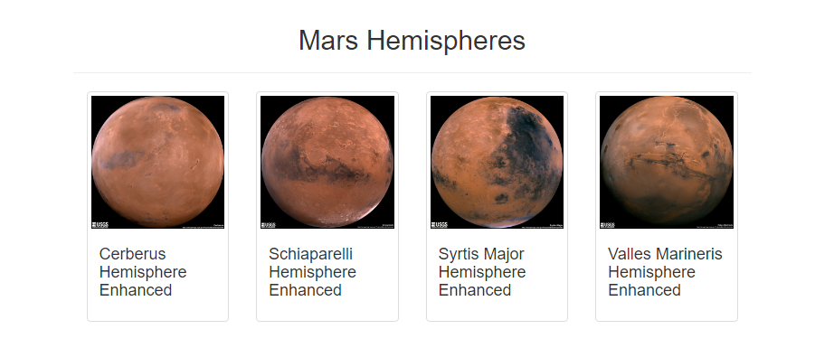

# Mission to Mars

## Overview of The Analysis

Robin is creating a web app that scrapes the sites she frequents for updated information on Mars. By using Python, Splinter, BeautifulSoup, Bootstrap, Mongo database, and HTML, we have created this website. In addition to the latest Mars news and facts, Robin has added full-resolution images of all four hemispheres of Mars with their titles.

## Results

At the bottom of the website, you can see the four Mars hemispheres as thumbnails with their titles.